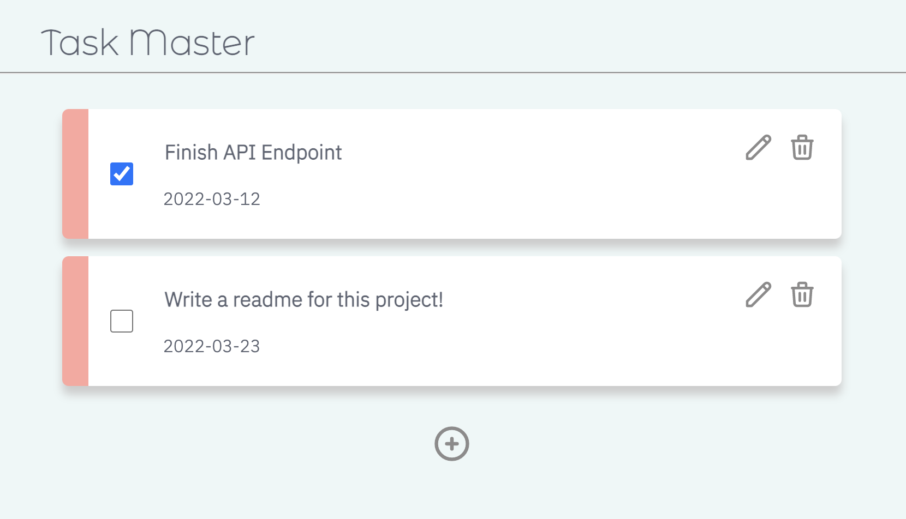

# Task Master



## Introduction

This is a task management & todo list application. Users can add, delete, update tasks, and check "completed" for each task. These tasks are managed on database and renders tasks on serverside except for update. For update, it uses REST API and Javascript HTTP request in order to practice different pattern.

Through making this app, I practiced:
- Python
- Flask 
- SQLAlchemy
- SQL Database
- Jinja2
- REST API
- HTML/CSS/JavaScript

## Requirements
- Python 3.8+
- Python 3 Virtual Environment
- pip

## Installation
1. Create and activate a virtual environment
```shell
python3 -m venv venv 
source venv/bin/activate
```
2. Install required dependencies
```shell
pip install -r requirements.txt
```

## Usage
1. Start the server.
```shell
flask run
```
2. Navigate to [http://127.0.0.1:5000/](http://127.0.0.1:5000/)